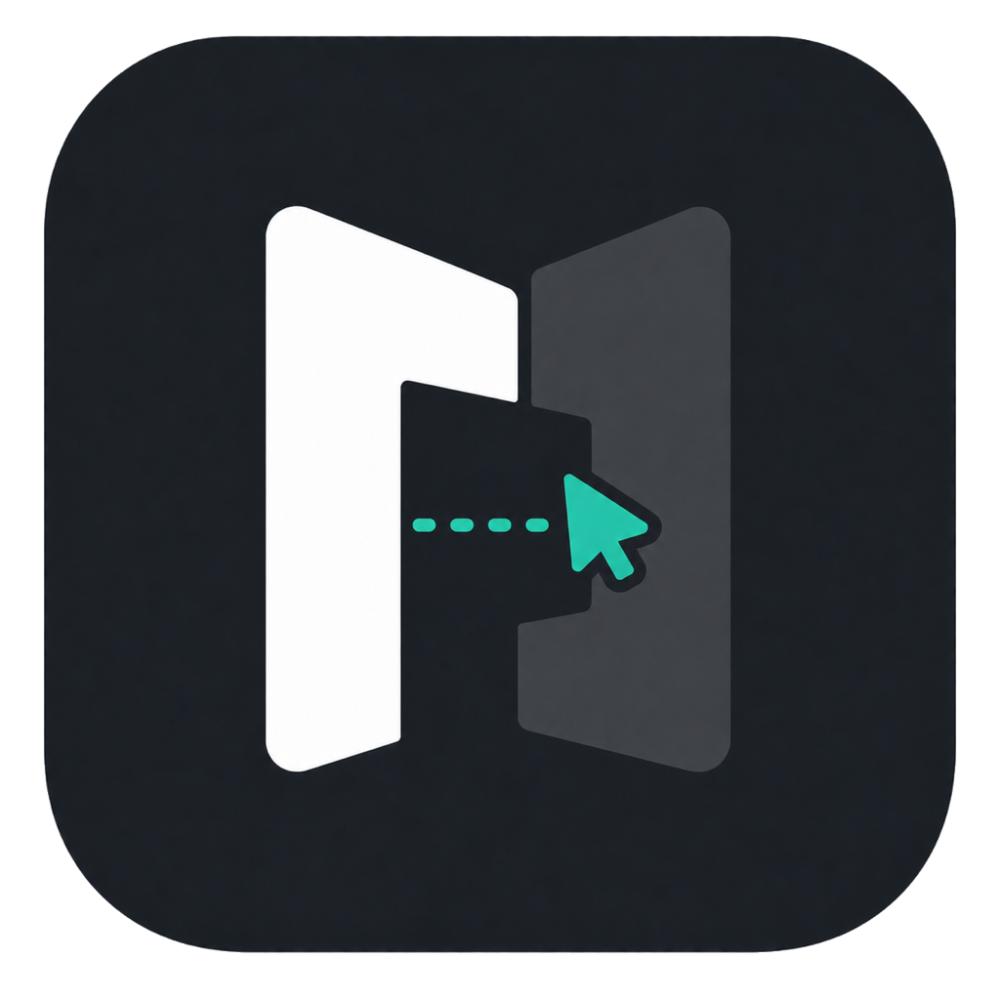

# Passwall

[English](README.md)

## 下载并安装

### [下载 Windows 接收端 · 安装 EXE](https://github.com/lvsicong123-cell/passwall-app/releases/download/v0.1.1/Passwall-Setup.exe)
Windows 11 x64，包含 .NET 运行时。双击安装，无需解压或手动运行命令。

### [下载 Mac 客户端 · 安装 PKG](https://github.com/lvsicong123-cell/passwall-app/releases/download/v0.1.1/Passwall.pkg)
Apple Silicon，macOS 14+。双击按系统向导安装到“应用程序”。

[版本说明及校验文件](https://github.com/lvsicong123-cell/passwall-app/releases/tag/v0.1.1)
· 两台电脑各安装对应客户端，再在下方完成首次配对。

**用 MacBook 的触控板和键盘，控制旁边的 Windows。**

不用来回换键鼠，保留熟悉的 Mac 操作习惯。Passwall 通过可信局域网连接两台
电脑，支持跨屏控制、双向剪贴板，以及需要接收确认的文件和文件夹传输。
它不是远程桌面，不传输屏幕画面；Windows 仍使用自己的显示器。



> [!WARNING]
> `v0.1.1` 是免费开源的 Public Alpha，不是全环境验证的稳定版。
> Mac 包仅有本地 ad-hoc 签名，没有 Apple Developer ID 签名或公证；Windows
> 程序没有 Authenticode 签名。首次打开可能被系统拦截。只在你信任的设备和
> 局域网中试用，不要为安装本软件关闭系统安全防护。

GitHub 的 `Source code (zip)` / `Source code (tar.gz)` 是源码，不是安装包。
当前 Mac 候选包不是 Universal 包，不提供已验证的 Intel Mac 下载版本。
安装包的 CI 安装检查不等于普通用户首次下载、安全提示、真机输入和重启恢复验收；
这批新安装包的上述真机项目仍为 **NOT RUN**。

## 首次使用

1. **Windows：**双击 `Passwall-Setup.exe`，按向导安装。桌面快捷方式默认勾选，
   登录启动可选。完成后打开 Passwall Receiver，接收端会驻留系统托盘。
   更新或卸载前先结束传输，从托盘退出接收端；安装器不会强杀运行中的程序。
2. **Mac：**双击 `Passwall.pkg`，按向导安装；系统可能要求管理员确认。
   从“应用程序”打开 Passwall。升级前先退出旧版；若旧版在其他文件夹，之后
   请改用“应用程序”里的版本，避免打开两份。
   按提示在“系统设置 → 隐私与安全性 → 辅助功能”中允许 Passwall；若系统询问
   本地网络权限，仅在你信任该应用和网络时允许。
3. **连接：**让两台设备处于同一可信局域网，在 Mac 中选择发现的 Windows，
   核对并确认两端显示的六位配对码。
4. **控制：**按实际位置设置屏幕布局，启动输入共享，再将指针推过对应屏幕边缘。
   将指针移回连接边缘，或按 `Option-Escape`，可返回 Mac。
5. **剪贴板：**需要时单独启用剪贴板共享；默认关闭。启用后再复制新内容，
   支持文字、富文本及单张 PNG/JPEG 图片。
6. **文件：**在传输页面选择文件/文件夹或拖入待发送内容，由接收端确认目的地和接收。
   这是显式文件传输，不是把 Finder 文件复制到剪贴板后直接在 Windows 粘贴。

### 安全提示与连接排查

- **Mac 无法验证开发者：**先核对来源和哈希；确认可信后，可参考
  [Apple 官方说明](https://support.apple.com/zh-cn/102445)为该应用单独允许打开。
  如果没有“仍要打开”、提示有害软件，或设备受组织管理，请停止并反馈，
  不要关闭 Gatekeeper 或执行全局放行命令。
- **Windows 安全提示：**未签名或声誉不足的程序可能被 SmartScreen 拦截。
  核对来源和哈希；如果组织策略不允许，停止安装，不关闭 Defender 或绕过策略。
- **发现不了设备：**确认接收端运行中、设备不在相互隔离的访客网络；
  如防火墙询问，只对可信专用网络授权，不要关闭整个防火墙。
- **连接后不能控制：**检查 Mac 辅助功能权限和输入共享状态。Windows UAC
  安全桌面不受支持；应在 Windows 本机处理提示，再继续普通桌面操作。

### 校验下载

校验是可选的高级检查，不是安装命令。将安装包和对应 `.sha256` 放在同一目录。Mac：

```bash
shasum -a 256 -c Passwall.pkg.sha256
```

Windows PowerShell：

```powershell
$archive = "Passwall-Setup.exe"
$expected = (Get-Content "$archive.sha256" -Raw).Trim().Split()[0]
$actual = (Get-FileHash $archive -Algorithm SHA256).Hash
if ($actual -ne $expected) { throw "SHA-256 mismatch. Do not install." }
Write-Host "SHA-256 OK"
```

哈希一致只能说明文件与发布者提供的校验值一致，不替代可信来源、签名或安全审查。

### 开机启动与卸载

Mac 可在 Passwall 设置中选择登录时启动。卸载前关闭该选项并退出应用，再将
`Passwall.app` 移到废纸篓。

Windows 安装到当前用户的 `%LOCALAPPDATA%\Passwall\App`，无需管理员权限。
重新运行安装器可调整“登录启动”；卸载使用“设置 → 应用 → 已安装的应用 →
Passwall Receiver → 卸载”，或开始菜单中的卸载入口。不需要运行 PowerShell。
安装器内部的 PowerShell 辅助检查仅使用进程级执行策略，不修改全局设置，
也不覆盖组织组策略；策略不允许时会报错停止。
卸载保留设置、信任记录、收到的文件和非程序文件，参见[隐私说明](PRIVACY.md)。

## 功能

- 跨屏边缘切换、相对指针移动和缩放感知的进入位置映射
- 精确双轴滚动、可配置手势和 Mac 到 Windows 快捷键转换
- 键盘转发，并保留 `Option-Escape` 用于立即返回 macOS
- TLS 1.3 配对、证书固定和可信设备恢复连接
- 断线或接收端故障后释放所有按键和鼠标按钮
- 可选的纯文本、RTF、HTML 和单张 PNG/JPEG 剪贴板传输
- 显式文件/文件夹请求、接收确认、进度、取消、重试和 SHA-256 校验
- 原生 SwiftUI macOS 应用和 WinForms Windows 接收端

## 环境要求

- 下载包的控制端使用 Apple Silicon Mac，macOS 14 或更高版本
- 接收端使用 Windows 11 x64
- 从源码构建 Windows 接收端需要 .NET 8 SDK
- 两台设备位于同一个可信局域网

已验证环境和公开 Alpha 的已知限制见[兼容性矩阵](docs/COMPATIBILITY_MATRIX.md)。

当前不支持互联网中继、屏幕视频、Windows UAC 安全桌面控制、断点续传、
目录同步或剪贴板文件语义。不提供自动更新；升级时请同时更新两端。

## 反馈

请通过本仓库 **Issues** 的 Bug 模板反馈版本、系统、操作步骤和实际结果。
提交截图或日志前，请遮住设备名、用户名、网络地址、配对码和个人文件信息。
安全漏洞不要公开发 Issue，请按照[安全报告流程](SECURITY.md)私下报告。

## 构建与测试

Mac 源码构建需要 Swift 6 工具链和 macOS SDK，包按构建机器的架构生成。
普通 Windows 下载用户不需要另外安装 .NET。

在 macOS 上：

```bash
swift test
swift build
./script/build_and_run.sh --package
bash script/package-macos-installer.sh
(cd dist && shasum -a 256 -c Passwall.zip.sha256)
```

`./script/build_and_run.sh --verify` 还会把开发版应用安装到
`~/Applications` 并启动它。

在已登录的 Windows 交互桌面 PowerShell 中：

```powershell
dotnet run --project Windows\PasswallReceiver.Checks\PasswallReceiver.Checks.csproj -c Release
dotnet build Windows\PasswallReceiver\PasswallReceiver.csproj -c Release
powershell -ExecutionPolicy Bypass -File .\Windows\package-release.ps1
```

Windows 打包需先安装 NSIS 3（CI 固定使用 3.12）。
Windows 归档默认包含 .NET 运行时。仅在需要更小的开发包时使用
`-FrameworkDependent`，此时目标机器必须已安装 .NET 8 Runtime。

## 安全与隐私

Passwall 不提供互联网中继、云账户、数据分析或自动更新服务。输入和内容只通过
经过认证的 TLS 连接在局域网内传输。剪贴板共享默认关闭，每批传入文件都需要
明确确认。测试前请阅读 [SECURITY.md](SECURITY.md) 和 [PRIVACY.md](PRIVACY.md)。

Passwall 无法控制 Windows UAC 安全桌面，也不会申请提权来绕过该边界。

## 项目文档

- [发布说明](docs/RELEASE_NOTES.md)
- [产品规格](docs/PRODUCT_SPEC.md)
- [架构](docs/ARCHITECTURE.md)
- [协议](docs/PROTOCOL.md)
- [兼容性矩阵](docs/COMPATIBILITY_MATRIX.md)
- [贡献指南](CONTRIBUTING.md)
- [变更记录](CHANGELOG.md)

## 许可证

本项目使用 [Apache License 2.0](LICENSE)。当前 Alpha 完整免费，无激活码或订阅。
